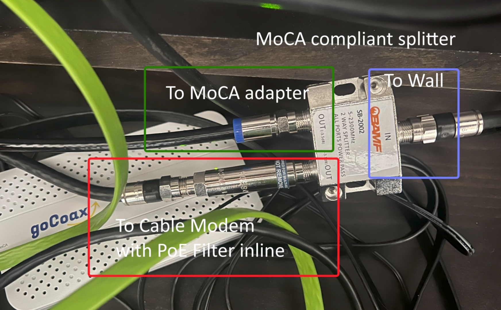

<!-- markdownlint-disable MD026 -->

# MoCA 2.5 Home Network Setup Guide

A practical guide to building a high-performance home network using MoCA 2.5
technology, based on real-world implementation experience in May 2025. I have
cable modem internet service, but this guide should work equally well with
fiber-to-the-home or any other internet delivery technologies.

Copyright 2025 Preston Landers and licensed under [MIT License](./LICENSE).

## Quick Start (TL;DR)

1. Buy goCoax MA2500D adapters (one per location).
2. Install a MoCA PoE filter at your cable service entry point.
3. Replace old splitters with MoCA-compatible ones.
4. Test cable continuity before assuming dead outlets.
5. If internet dies when MoCA activates, add a second PoE filter at the modem.

## Overview

This guide documents my personal process and lessons from upgrading from a slow
home powerline ethernet setup (100 Mbps) to a blazing-fast five node MoCA 2.5
network with **2.4+ Gbps sustained throughput** with zero packet loss. It was
not a completely smooth experience due to some unexpected issues with my house
wiring, but hopefully this guide lets you benefit from my experiences.

My house did not come wired for ethernet, and it was impractically expensive to
run new cables through the walls. WiFi is always an option but I prefer a
hardline connection for reliability and performance, especially for gaming. I
had been using AC power line adapters (TP-Link AV2000) for a while. Although it
is pretty cool that they work at all, I was only seeing about 100 to 150 Mbps
throughput at best, which was unsatisfactory.

In the course of attempting to set up my MoCA network, I discovered my house's
existing coaxial cable infrastructure was incomplete, forcing me to diagnose and
repair it before I could achieve the performance I wanted. I hope this guide
will help you avoid some of those pitfalls and get the most out of your MoCA
setup.

## Why MoCA?

Do you get gigabit fiber to the home, but struggle with delivering all that
speed to your endpoint devices such as PCs, laptops, game consoles, etc? Mesh
WiFi networks are often a solution but can be expensive, and almost never
deliver the kind of rock-solid low-latency connection needed for competitive
gaming. MoCA uses your existing cable TV wiring to enable a very high
performance local network without needing to run new ethernet cables through
walls or ceilings. Even if many or most of your devices still use WiFi, you can
often benefit by moving your most performance sensitive devices like PCs onto a
wired network, freeing up WiFi bandwidth for other devices.

### What is MoCA?

MoCA (Multimedia over Coax Alliance) allows you to create a high-speed ethernet
network using your home's existing coaxial cable infrastructure; in other words,
cable TV wiring. MoCA 2.5 can theoretically deliver up to 2.5 Gbps shared
bandwidth across your network.

### Performance Results

- **Theoretical Max**: 2.5 Gbps
- **Real-world Achievement**: 2.35-2.41 Gbps sustained (94-96% efficiency) as
  measured by [`iperf3`](#performance-testing).
  - Obviously, your results may vary based on your specific coax infrastructure,
    number of nodes, the quality of the wiring, interference from neighbors, and
    other factors.
- **Improvement over Powerline**: 23x faster.
- **Packet Loss**: Zero retransmissions during my testing.

## Equipment Used

Prices were on Amazon US as of May 2025.

### MoCA Adapters

- **goCoax MA2500D** (MoCA 2.5 with 2.5GbE ports) - ~$65 each
  - You'll want one for each location or room that has a coax outlet and needs
    ethernet connectivity.
  - You can use a small switch in each room to connect multiple devices to each
    MoCA adapter as needed.

### Infrastructure Components

- **MoCA PoE Filter** (PPC a BELDON Brand) - $8 each
  - This is a "Point of Entry" filter that makes sure MoCA signals do not leak
    outside or into your home, which is critical for security and performance.
  - Important: You might need a second one for the cable modem itself, as
    [explained below](#important-second-poe-filter-at-cable-modem)
- **MoCA compatible Splitters**: Make sure all cable splitters involved are MoCA
  compatible, ideally with up to a 2300MHz range.
  - **BAMF 2-Way MoCA Splitter** (5-2300MHz) - $10 - for indoor use between the
    cable modem and MoCA adapter.
    - You may need a 3 way splitter indoors if you also use traditional cable TV
      (i.e., a separate cable TV box.)
  - **BAMF 6-Way MoCA Splitter** (5-2300MHz) - $15 - for outdoor distribution
    box.
- **Coax terminators** for unused ports, either on splitters or wall outlets -
  $7 for a pack of 10.
- **Coax cable tester with tone generator** for cable mapping / testing.
  - I used a Jonard PT-300, a simple tone generator/continuity tester, which
    worked fine. - ~$26.
- You may need a **coax cable crimper tool / kit** if you need to make custom
  coax cables or replace connectors. I used a basic kit from Amazon for $30
  because I only needed to terminate a few existing cables.
  - You may also need to buy some additional RG6 connectors if you need to
    practice your crimping skills or replace many connectors.

### Network Equipment

It's important to make sure the rest of your network infrastructure is up to
date to avoid any bottlenecks or performance issues:

- **Quality router**
  - As part of this upgrade I replaced an older Netgear WAX204 with a TP-Link
    Archer GE800 with 10 Gbps and 2.5 Gbps ports, which has excellent
    performance.
- **Quality 2.5GbE switches**
  - Cheap switches can definitely cause performance issues, such as a high
    number of TCP retransmits and slightly lower throughput, even if they are
    rated for 2.5 Gbps.
  - I have had good results with the TP-Link "TL-SG105S-M2" model 5-port 2.5
    Gbps switch - ~$75.

## Pre-Installation Planning

### 1. Assess Your Coax Infrastructure

**Find your cable demarcation box** (usually outside):

- Look for where cable/internet enters your house.
  - This may be a small outdoor box or a wall plate inside.
- Look for the place where main incoming splits out into multiple coax cables
  that run to different rooms.
- Count the "home run" cables leading into your house. In the ideal case, you
  have a separate one leading to each outlet that you want to use.
- You may find that some outlets are shared between home run lines by an
  internal splitter somewhere.
- Check any existing splitters you can find along any cable paths. Older ones
  may not support MoCA frequencies.

**Map your coax outlets**:

The goal here is to understand which outlet within your home connects to which
home run cable. This will help you plan where to install MoCA adapters and
prevents surprises during installation. This is also an ideal time to label your
home run cables if they are not already labeled.

Use a coax cable tester with a tone generator. You connect the tone generator to
a cable at your central distribution box, then take the separate probe/wand to
each outlet inside. When the probe makes a buzzing sound at an outlet, you've
found the other end of that cable. If necessary, you can do this in reverse -
connect the generator to an interior outlet, and use the probe outside.

If you get a strong, solid sound, you should have a good continuity test. See
the [troubleshooting](#troubleshooting-a-real-world-guide) section below for
more details on coax cable testing.

#### Don't just test, inspect!

If an outlet appears dead, the next step should be to remove the wall plate and
visually confirm the cable is physically connected to the jack outlet before
assuming the cable run is bad.

When I first moved into my current house, I only used one cable outlet for the
cable modem and never bothered to check the rest of my outlets. Then when I went
to go set up my MoCA network I thought I had 4 dead outlets in the house and
only 1 other outlet working. It turns out that for whatever reason, whoever did
the wiring in this house never bothered to physically connect up the wall
outlets to the home run cable behind them.

My initial testing with the tone generator produced some puzzling results with
most of the house looking dead, until I finally thought to open up and check
behind the wall outlets. There were also two unterminated home run cables at the
outdoor cable demarcation box, so I also had to add RG6 connectors there in
order to hook them up to the splitter. The coax crimping tool came in handy
here.

### 2. Check Existing Equipment

**Splitters must be MoCA compatible**:

- ✅ Good: 5-2300MHz or higher frequency range
- ❌ Bad: 5-1002MHz (this will kill MoCA performance)

**Identify any existing filters**:

Check any existing filters or splitters anywhere in your signal path,
particularly at the cable demarcation box, to make sure they are MoCA frequency
compatible. Cable companies or contractors often install basic filters or
grounding points, so don't assume they're MoCA PoE filters.

## Installation Process

### Step 1: Install PoE Filter

**Critical for security and performance**:

Make sure to install a MoCA PoE filter at the point where the cable enters your
home. This filter prevents your MoCA signals from leaking to your neighbors, or
their MoCA signals from interfering with yours. It's critical that you have a
PoE filter installed before any MoCA devices in your home network. It should be
installed at the main cable entry point before any splitters out to your home
runs.

If for some reason you are unable to install a PoE filter, it is critical that
you [enable MoCA encryption](#moca-encryption) on your MoCA adapters to prevent
any potential interference or security issues.

**Signal flow**: `Street → PoE Filter → MoCA Splitter → Home Runs`

Installing the PoE filter in between the grounding block and the main outside
splitter works fine, or before the grounding block too. It must be before (in
front of) any splitters to your home runs. The filter I used can be installed
bi-directionally, so it doesn't matter which way you install it.

**See the [note below](#important-second-poe-filter-at-cable-modem) about
multiple PoE filters.** You may need a second PoE filter installed between the
cable modem and the MoCA adapter.

### Step 2: Upgrade Splitters

Replace any non-MoCA splitters with MoCA-compatible versions:

- **Outdoor box**: Use appropriate multi-way splitter for your home runs.
- **Indoor locations**: Only where you need to split the signal.
- **Most locations**: MoCA adapters plug directly into wall outlets.

### Step 3: Install MoCA Adapters

You'll need at least 2 MoCA adapters, one for the router location and one for
each device location that needs ethernet connectivity. Your cable modem doesn't
necessarily have to be installed at the same location as your MoCA adapter, but
it is often convenient to do so, in which case you might need an indoor
MoCA-compatible splitter and possibly a second PoE filter.

**At your router location**:

- Use 2-way splitter: one output to cable modem, one to MoCA adapter
  - If necessary, use a 3-way splitter if you also have a cable TV box.
- Connect the MoCA adapter to a LAN port on your router or a 2.5GbE switch.
- Connect the cable modem to the other output of the splitter, and then connect
  the modem to your router's WAN port.

#### Important: Second PoE Filter at cable modem

If you experience interference or performance issues, or your internet just
[dies when MoCA is active](#problem-internet-connection-drops-when-moca-is-active),
consider installing a second PoE filter between the cable modem after the split
for the MoCA adapter. This can help prevent any potential interference between
the MoCA network and your cable modem, because the PoE filter will block MoCA
signals from reaching the modem.

When I first installed a 2-node MoCA network, I didn't have any interference
issues, but when I added additional nodes, my cable modem would be knocked
offline immediately as soon as the MoCA network light came on the adapter.
Installing a PoE filter between the cable modem and the MoCA adapter completely
resolved this issue. I theorized that the nearby MoCA adapter became too "loud"
for the cable modem to handle, and the PoE filter eliminated that signal.

#### In other rooms

Simply plug the MoCA adapter into the coax outlet in each room where you need
ethernet connectivity. If you only have a single device to plug in, you can
connect it directly to the MoCA adapter's ethernet port. Otherwise, you'll want
to connect a small switch to the MoCA adapter to provide additional ports. It's
worth investing in a quality 2.5GbE switch for this purpose; cheaper switches
can bottleneck performance or cause instability.

#### MoCA Encryption

Many MoCA adapters including the goCoax MA2500D support MoCA encryption, which
adds an extra layer of security to your network. Typically this is not turned on
by default, and sometimes you have to enable it manually in the adapter's web
interface. If you are concerned about security, especially if you live in a
multi-unit building such as an apartment complex or don't have access to the
cable splits, consider enabling this feature. In theory, a PoE filter should
prevent any MoCA signals from leaking outside your home, but enabling encryption
adds an extra layer of protection.

However, if you operate a MoCA network in a typical detached single-family home,
and have properly installed a PoE filter at the point of entry, you probably do
not need or want to enable encryption. It can slightly degrade performance and
adds additional complexity to your setup.

### Step 4: Terminate Unused Ports

Install 75-ohm terminators on any unused splitter outputs to prevent signal
reflections. Also consider terminating any unused coax wall outlets in your home
if you have any interference issues.

## Key Lessons Learned

### 1. Quality Components Matter

**Cheap or outdated routers or 2.5GbE switches can bottleneck performance** -
invest in quality network equipment.

### 2. PoE Filter Placement

Standard placement is at house entry, but sometimes **placing between cable
modem and nearby MoCA adapter** resolves specific interference issues.

### 3. Router Bottlenecks

Even with perfect MoCA performance, a router with only 1GbE ports will limit:

- Internet speeds (if you have >1Gbps service)
- Traffic between MoCA network and WiFi devices

**However**: Direct PC-to-PC traffic over MoCA bypasses the router entirely and
gets full speed.

### 4. Network Settling Time

Even if you are not swapping out your router, you may want to power cycle your
cable modem, router and other equipment after the installation and let things
settle down for a few minutes. In particular, turn your cable modem on first,
give it time to sync up, then turn on your router. Allow a few moments for the
MoCA adapters to establish connections and show the "MoCA" light before testing.

### 5. Cable Mapping is Essential

Don't skip the cable testing phase - understanding your coax infrastructure
prevents hours of troubleshooting.

## Troubleshooting: a real world guide

### Problem: MoCA Adapter Light is off / no connectivity

This likely indicates a break in the physical coax path.

First, test continuity. Use a coax cable tester with a tone generator and probe
to see if a signal can travel from your central distribution point to the wall
outlet in question.

If the continuity test fails (no tone):

- **CRITICAL STEP**: Inspect the wall plate. Before assuming a bad cable in the
  wall, remove the wall plate. In many cases, the cable may simply be
  unconnected to the back of the jack. This is a common issue in houses where
  not all outlets were used by previous owners.

- Check all splitters. Verify every splitter in the path to that outlet is
  MoCA-compatible. A single old 5-1002MHz splitter will kill the signal.

- Inspect for physical damage. Check for kinked or cut cables in your attic,
  basement, or outdoor box.

### Problem: Internet connection drops when MoCA is active

This can happen when the powerful signal from the MoCA adapter sharing a
splitter with your modem is overwhelming the modem's sensitive tuner.

**Symptom**: Your cable modem works perfectly, but as soon as you power on your
MoCA adapters and they form a network, your modem's "online" light begins to
flash or turn off, and your internet connection dies.

**Diagnostic step**: check that the internet connection is stable when the modem
is connected directly to the wall, but fails when the MoCA adapter is introduced
on the same splitter.

**Solution**: Install a second MoCA PoE filter directly on the cable modem's
input, as [described above](#important-second-poe-filter-at-cable-modem). This
will prevent MoCA signals from interfering with the cable modem's operation.

### Problem: Internet speeds are slow, but MoCA speeds are fast

**Symptom**: You're getting full multi-gigabit speeds between MoCA nodes (for
example, as tested through [`iperf3`](#performance-testing)), but internet speed
tests are much lower than your ISP plan's speed.

**Diagnostic step**: Instead of connecting your cable modem to your router,
connect it directly to a computer. Turn off the cable modem, then back on, and
allow it to come online. Then reboot your computer and run an internet speed
test. If the speed is high, the bottleneck is your router.

**Additional checks**: Log into your router's admin panel and disable
processor-intensive features. Check the QoS (Quality of Service) setting in your
router; this or Port Scan / DoS protection features, can sometimes cause
performance issues on cheaper / lower powered consumer routers. QoS in
particular is often not really necessary for home networks. These features force
the router's CPU to inspect every data packet, which can create a bottleneck on
high-speed connections.

**Solution**: First try rebooting your router or a factory reset. Upgrade your
router to one with 2.5GbE or higher ports that is known to have good performance
with multi-gigabit connections.

### Problem: MoCA network is unstable or has high packet loss

**Symptom**: Your `iperf3` [tests](#performance-testing) show decent speed
(e.g., 1.9 Gbps) but also show a high number of TCP Retransmits (`Retr`).

**Cause**: This is often caused by lower-quality endpoint equipment. As learned
in this project, a cheap, no-name 2.5GbE switch can introduce significant packet
loss.

**Solution**: Invest in quality networking equipment from reputable brands. A
good switch should result in near-zero retransmits during testing.

### General Performance Issues

- Check all splitters are MoCA-compatible (5-2300MHz minimum).
- Verify PoE filter installation both at the outside and possibly in front of
  your cable modem as mentioned above.
- Test with quality Cat-5e or better ethernet cables.
- Check if your MoCA adapters have the latest firmware.

### Connectivity Issues

- Confirm coax continuity with cable tester.
- Check for loose or unterminated connections.
- Try different coax outlets.

## Performance Testing

### Recommended Tools

- **iperf3** for network throughput testing.
  - This is a Linux-based tool, but there are Windows and Mac versions
    available, and it can be run under WSL on Windows.
  - I ran the server mode on my Linux server and the client mode on my Windows
    PC to measure performance.
- **speedtest.net** for internet speed verification
- Check your normal internal file transfers or your other normal network usage
  patterns to see if you notice any improvements.

### Expected Results

- **MoCA 2.5**: 2.0-2.5 Gbps depending on conditions.
- **Internet**: Should match or exceed your ISP plan.
- **Zero packet loss** in a properly configured system.

## Cost Breakdown

Approximate costs for a 5-location setup:

- MoCA Adapters (5x): $325
- PoE Filter (2x): $16
- MoCA Splitters: $20-30
- Terminators & misc: $20
- Coax Cable Tester and Crimper: ~$60
  - (You may not need these, depending on your cabling situation.)
- **Total MoCA Infrastructure**: ~$450-500

Also consider whether you need to
[upgrade your router](#problem-internet-speeds-are-slow-but-moca-speeds-are-fast)
or any switches to 2.5+ Gbps to realize the system's full potential.

## Final Thoughts

MoCA 2.5 transforms home networking by leveraging existing coax infrastructure
to create a high-speed backbone. With proper planning and quality components,
you can achieve near-theoretical maximum performance and eliminate the
instability issues common with powerline adapters and WiFi-only setups.

The investment in time and equipment pays dividends in network reliability,
speed, and future-proofing your home infrastructure.

---

_This guide is based on a real implementation that achieved 2.4 Gbps sustained
throughput with zero packet loss across a 5-node MoCA network. I genuinely hope
this helps some people out there. Please let me know your results!_
